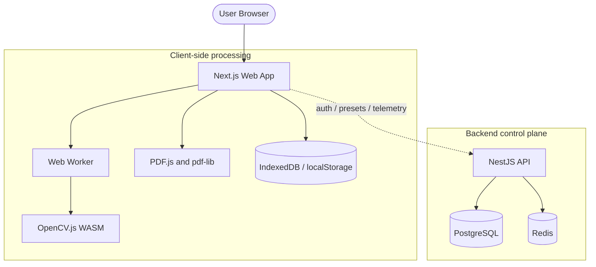

# PDFCleaner

PDFCleaner is a privacy-first scanned PDF cleaning app powered by OpenCV.js WebAssembly.

It cleans scanned PDFs and images directly in the browser. File parsing, page rendering,
image cleanup, preview generation, and output reconstruction run client-side through Web
Workers and WebAssembly, so user documents do not need to be uploaded to the backend.

## Features

- Browser-side PDF and image cleanup with PDF.js, pdf-lib, OpenCV.js, and Web Workers.
- Zero-file backend: the API handles auth, saved presets, telemetry, limits, and admin data,
  but does not store PDF files, page images, OCR text, or document content.
- Cleaning presets for light cleanup, background removal, contrast boost, print optimization,
  noise reduction, and color preservation.
- Optional auto-deskew for tilted scans.
- Local document history stored in the browser.
- Optional account system for saved presets.
- Anonymous telemetry with local opt-out.
- Light and dark mode with hydrated client-side theme state.
- Vietnamese and English UI strings.

## Tech Stack

- Frontend: Next.js, React, Tailwind CSS, Framer Motion, pdfjs-dist, pdf-lib.
- Processing: OpenCV.js WebAssembly in a Web Worker.
- Backend: NestJS, Prisma, PostgreSQL, Redis, JWT cookies.
- Tooling: pnpm workspaces, Turborepo, ESLint, Prettier, TypeScript, Vitest, Jest.
- Deployment: Docker and Docker Compose examples.

## Repository Structure

```text
apps/
  api/                  NestJS backend control plane
  web/                  Next.js frontend
packages/
  shared/               Shared types, constants, and preset configuration
  processing-engine/    OpenCV.js pipeline and worker contract
docs/
  ADR/                  Architecture decision records
  ARCHITECTURE.md       System overview
  DEPLOYMENT.md         Production deployment guide
  PRIVACY.md            Zero-file backend privacy model
notebooks/              Algorithm demos and sample generation scripts
```

## Architecture



Read more in [docs/ARCHITECTURE.md](docs/ARCHITECTURE.md) and
[docs/ADR](docs/ADR/).

## Prerequisites

- Node.js 20 or newer
- pnpm 10.22.0 or newer
- Docker Desktop, if you want to run the local API database and cache

## Quick Start

```bash
git clone https://github.com/GrootTheDeveloper/PDFCleaner.git
cd PDFCleaner
pnpm install
cp .env.example .env
pnpm docker:up
pnpm db:generate
pnpm db:migrate
pnpm dev
```

Open:

- Web app: http://localhost:3000
- API: http://localhost:3001/api/v1
- Swagger, in development: http://localhost:3001/api/docs

The core PDF cleaning flow can still work when the API is offline because document
processing runs in the browser.

## Useful Scripts

```bash
pnpm dev            # Start all dev servers through Turborepo
pnpm docker:up      # Start local PostgreSQL and Redis
pnpm docker:down    # Stop local PostgreSQL and Redis
pnpm db:generate    # Generate Prisma client
pnpm db:migrate     # Apply local development migrations
pnpm lint           # Run ESLint
pnpm typecheck      # Run TypeScript checks
pnpm test:ci        # Run package test suites with CI-safe commands
pnpm test:e2e       # Run API e2e and privacy tests
pnpm build          # Build all workspaces
pnpm release:check  # Run lint, typecheck, tests, and build
```

## Production Build

For local production-style Docker Compose:

```bash
cp .env.production.example .env.production
# Edit .env.production with real secrets and public URLs.
pnpm prod:up
```

Production containers:

- Web: http://localhost:3000
- API: http://localhost:3001/api/v1

See [docs/DEPLOYMENT.md](docs/DEPLOYMENT.md) for deployment notes and required
environment variables.

## Privacy Model

PDFCleaner is designed around a zero-file backend. The backend does not expose upload
routes and does not store document files. It only receives control-plane data such as
authentication requests, preset metadata, anonymous telemetry, sanitized error reports,
and admin configuration requests.

See [docs/PRIVACY.md](docs/PRIVACY.md) for details.

## Contributing

Contributions are welcome. Please read [CONTRIBUTING.md](CONTRIBUTING.md), run
`pnpm release:check` before opening a pull request, and include tests for behavior changes.

## Security

Please report vulnerabilities according to [SECURITY.md](SECURITY.md).

## License

MIT. See [LICENSE](LICENSE).
